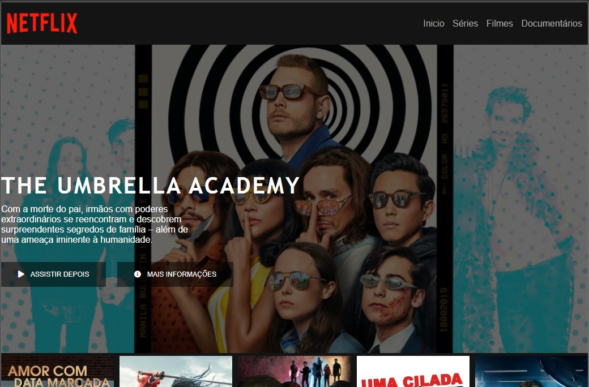
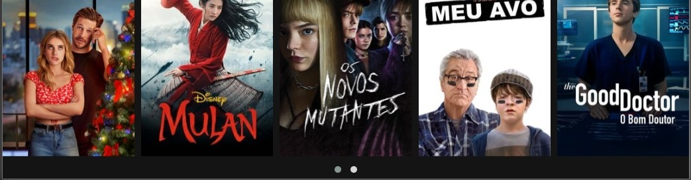

# Projeto NETFLIX Clone desenvolvido atráves de videoaulas da Digital Innovation One

O foco do projeto:
- era o entendimento das tags semânticas do HTML;
- uso do display flex no CSS;
- uso de variaveis em CSS;
- utilizar icones do font awesome para personalizar os botões;
- visualizar como o layout é dividido em caixas;
- uso da biblioteca jquery para fazer um carrossel de imagens;

## Imagem do Projeto

